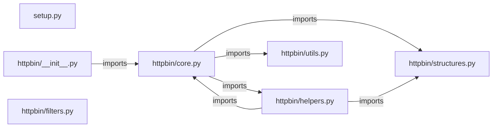

# httpbin — project architecture

[README](README.md) · [Interview questions and answers](INTERVIEW_QA.md)

## Purpose and scope

A fork of the Python and Flask HTTP request and response inspection service.

This document describes files and symbols in this checkout. Deployment templates and statements in the original overview are distinguished from a verified running environment.

## Component diagram



For Python repositories, arrows show resolved local imports, not network calls or deployment order. Otherwise the diagram is a repository component map; containment arrows do not assert runtime integration.

## Components and responsibilities

| Component | Responsibility |
| --- | --- |
| [`httpbin/core.py`](httpbin/core.py) | HTTP handlers: `ROUTE /legacy`, `ROUTE /html`, `ROUTE /robots.txt`, `ROUTE /deny`, `ROUTE /ip` |
| [`httpbin/helpers.py`](httpbin/helpers.py) | Functions: `json_safe`, `get_files`, `get_headers`, `semiflatten`, `get_url`, `get_dict`, `status_code` |
| [`httpbin/filters.py`](httpbin/filters.py) | Functions: `x_runtime`, `gzip`, `deflate`, `brotli` |
| [`setup.py`](setup.py) | Implementation or supporting configuration |
| [`httpbin/__init__.py`](httpbin/__init__.py) | Implementation or supporting configuration |
| [`httpbin/structures.py`](httpbin/structures.py) | Functions: `_lower_keys`, `__contains__`, `__getitem__` |
| [`httpbin/utils.py`](httpbin/utils.py) | Functions: `weighted_choice` |
| [`Dockerfile`](Dockerfile) | Container build/service configuration |
| [`docker-compose.yml`](docker-compose.yml) | Container build/service configuration |
| [`test_httpbin.py`](test_httpbin.py) | Executable checks and regression examples |
| [`README.md`](README.md) | Project explanations or operating notes |

## Request interface

| Method and path | Handler | Source |
| --- | --- | --- |
| `ROUTE /legacy` | `view_landing_page` | [`httpbin/core.py`](httpbin/core.py#L241) |
| `ROUTE /html` | `view_html_page` | [`httpbin/core.py`](httpbin/core.py#L247) |
| `ROUTE /robots.txt` | `view_robots_page` | [`httpbin/core.py`](httpbin/core.py#L263) |
| `ROUTE /deny` | `view_deny_page` | [`httpbin/core.py`](httpbin/core.py#L282) |
| `ROUTE /ip` | `view_origin` | [`httpbin/core.py`](httpbin/core.py#L301) |
| `ROUTE /uuid` | `view_uuid` | [`httpbin/core.py`](httpbin/core.py#L317) |
| `ROUTE /headers` | `view_headers` | [`httpbin/core.py`](httpbin/core.py#L333) |
| `ROUTE /user-agent` | `view_user_agent` | [`httpbin/core.py`](httpbin/core.py#L349) |
| `ROUTE /get` | `view_get` | [`httpbin/core.py`](httpbin/core.py#L367) |
| `ROUTE /anything` | `view_anything` | [`httpbin/core.py`](httpbin/core.py#L387) |
| `ROUTE /anything/<path:anything>` | `view_anything` | [`httpbin/core.py`](httpbin/core.py#L387) |
| `ROUTE /post` | `view_post` | [`httpbin/core.py`](httpbin/core.py#L415) |
| `ROUTE /put` | `view_put` | [`httpbin/core.py`](httpbin/core.py#L433) |
| `ROUTE /patch` | `view_patch` | [`httpbin/core.py`](httpbin/core.py#L451) |
| `ROUTE /delete` | `view_delete` | [`httpbin/core.py`](httpbin/core.py#L469) |
| `ROUTE /gzip` | `view_gzip_encoded_content` | [`httpbin/core.py`](httpbin/core.py#L488) |
| `ROUTE /deflate` | `view_deflate_encoded_content` | [`httpbin/core.py`](httpbin/core.py#L505) |
| `ROUTE /brotli` | `view_brotli_encoded_content` | [`httpbin/core.py`](httpbin/core.py#L522) |
| `ROUTE /redirect/<int:n>` | `redirect_n_times` | [`httpbin/core.py`](httpbin/core.py#L538) |
| `ROUTE /redirect-to` | `redirect_to` | [`httpbin/core.py`](httpbin/core.py#L573) |
| `ROUTE /relative-redirect/<int:n>` | `relative_redirect_n_times` | [`httpbin/core.py`](httpbin/core.py#L648) |
| `ROUTE /absolute-redirect/<int:n>` | `absolute_redirect_n_times` | [`httpbin/core.py`](httpbin/core.py#L678) |
| `ROUTE /stream/<int:n>` | `stream_n_messages` | [`httpbin/core.py`](httpbin/core.py#L703) |
| `ROUTE /status/<codes>` | `view_status_code` | [`httpbin/core.py`](httpbin/core.py#L732) |
| `ROUTE /response-headers` | `response_headers` | [`httpbin/core.py`](httpbin/core.py#L781) |

The table lists literal route decorators found in the inspected Python modules. Router prefixes and middleware can add behavior; check the linked handler and application setup before calling an endpoint.

## Implementation walkthrough

### `status_code(code)`

Source: [`httpbin/helpers.py`](httpbin/helpers.py#L207).

Returns response object of given status code.

Calls visible in this function: `dict`, `json.dumps`, `make_response`.

```python
def status_code(code):
    """Returns response object of given status code."""

    redirect = dict(headers=dict(location=REDIRECT_LOCATION))

    code_map = {
        301: redirect,
        302: redirect,
        303: redirect,
        304: dict(data=''),
        305: redirect,
        307: redirect,
        401: dict(headers={'WWW-Authenticate': 'Basic realm="Fake Realm"'}),
        402: dict(
            data='Fuck you, pay me!',
            headers={
                'x-more-info': 'http://vimeo.com/22053820'
            }
        ),
        406: dict(data=json.dumps({
                'message': 'Client did not request a supported media type.',
                'accept': ACCEPTED_MEDIA_TYPES
```

The excerpt is truncated; the linked source contains the full implementation.

### `response(credentials, password, request)`

Source: [`httpbin/helpers.py`](httpbin/helpers.py#L311).

Compile digest auth response

If the qop directive's value is "auth" or "auth-int" , then compute the response as follows:
   RESPONSE = MD5(HA1:nonce:nonceCount:clienNonce:qop:HA2)
Else if the qop directive is unspecified, then compute the response as follows:
   RESPONSE = MD5(HA1:nonce:HA2)

Arguments:
- `credentials`: credentials dict
- `password`: request user password
- `request`: request dict

Calls visible in this function: `H`, `HA1`, `HA1_value.encode`, `HA2`, `HA2_value.encode`, `ValueError`, `b':'.join`, `credentials.get`, `credentials.get('cnonce').encode`, `credentials.get('nc').encode`, `credentials.get('nonce').encode`, `credentials.get('nonce', '').encode`.

```python
def response(credentials, password, request):
    """Compile digest auth response

    If the qop directive's value is "auth" or "auth-int" , then compute the response as follows:
       RESPONSE = MD5(HA1:nonce:nonceCount:clienNonce:qop:HA2)
    Else if the qop directive is unspecified, then compute the response as follows:
       RESPONSE = MD5(HA1:nonce:HA2)

    Arguments:
    - `credentials`: credentials dict
    - `password`: request user password
    - `request`: request dict
    """
    response = None
    algorithm = credentials.get('algorithm')
    HA1_value = HA1(
        credentials.get('realm'),
        credentials.get('username'),
        password,
        algorithm
    )
    HA2_value = HA2(credentials, request, algorithm)
```

The excerpt is truncated; the linked source contains the full implementation.

### `get_dict(*keys, **extras)`

Source: [`httpbin/helpers.py`](httpbin/helpers.py#L171).

Returns request dict of given keys.

Calls visible in this function: `all`, `d.get`, `data.decode`, `dict`, `get_files`, `get_headers`, `get_url`, `json.loads`, `json_safe`, `map`, `out_d.update`, `request.headers.get`.

```python
def get_dict(*keys, **extras):
    """Returns request dict of given keys."""

    _keys = ('url', 'args', 'form', 'data', 'origin', 'headers', 'files', 'json', 'method')

    assert all(map(_keys.__contains__, keys))
    data = request.data
    form = semiflatten(request.form)

    try:
        _json = json.loads(data.decode('utf-8'))
    except (ValueError, TypeError):
        _json = None

    d = dict(
        url=get_url(request),
        args=semiflatten(request.args),
        form=form,
        data=json_safe(data),
        origin=request.headers.get('X-Forwarded-For', request.remote_addr),
        headers=get_headers(),
        files=get_files(),
```

The excerpt is truncated; the linked source contains the full implementation.

### `gzip(f, *args, **kwargs)`

Source: [`httpbin/filters.py`](httpbin/filters.py#L39).

GZip Flask Response Decorator.

Calls visible in this function: `BytesIO`, `f`, `gzip2.GzipFile`, `gzip_buffer.getvalue`, `gzip_file.close`, `gzip_file.write`, `isinstance`, `len`, `str`.

```python
def gzip(f, *args, **kwargs):
    """GZip Flask Response Decorator."""

    data = f(*args, **kwargs)

    if isinstance(data, Response):
        content = data.data
    else:
        content = data

    gzip_buffer = BytesIO()
    gzip_file = gzip2.GzipFile(
        mode='wb',
        compresslevel=4,
        fileobj=gzip_buffer
    )
    gzip_file.write(content)
    gzip_file.close()

    gzip_data = gzip_buffer.getvalue()

    if isinstance(data, Response):
```

The excerpt is truncated; the linked source contains the full implementation.

## Validation and failure paths

| Explicit exception | Source |
| --- | --- |
| `ValueError` | [`httpbin/helpers.py`](httpbin/helpers.py#L308) |
| `ValueError('qop value are wrong')` | [`httpbin/helpers.py`](httpbin/helpers.py#L350) |
| `ValueError('%s required' % k)` | [`httpbin/helpers.py`](httpbin/helpers.py#L303) |
| `ValueError('%s required for response H' % k)` | [`httpbin/helpers.py`](httpbin/helpers.py#L342) |

These are explicit exceptions in the inspected source, rather than a claim that every failure is handled. Follow the calling handler to see whether the exception becomes an HTTP response or propagates.

## Data and state

- [`httpbin/core.py`](httpbin/core.py) defines module-level containers: `app.config['SWAGGER']`, `template`, `swagger_config`.
- [`httpbin/helpers.py`](httpbin/helpers.py) defines module-level containers: `ACCEPTED_MEDIA_TYPES`.

Module-level dictionaries/lists live in a Python process. They can be fixtures or mutable state; inspect writes before treating them as persistent storage. A production extension would need to define persistence and concurrency behavior explicitly.

## Data flow and design decisions

### What is the input-to-output contract of `status_code`

In [`httpbin/helpers.py`](httpbin/helpers.py#L207), `status_code(code)` receives the inputs. The function computes these intermediate values:

- `redirect = dict(headers=dict(location=REDIRECT_LOCATION))`
- `code_map = {301: redirect, 302: redirect, 303: redirect, 304: dict(data=''), 305: redirect, 307: redirect, 401: dict(headers={'WWW-Authenticate': 'Basic realm="Fake Realm"'}), 402: dict(data='Fuck you, pay me!', headers={'x-more-info': 'http://vimeo.com/22053820'}), 406: dict(data=json.dumps({'message': 'Client did not request a supported media type.', 'accept': ACCEPTED_MEDIA_TYPES}), headers={'Content-Type': 'application/json'}), 407: dict(head`
- `r = make_response()`
- `r.status_code = code`

Its result is defined by:

- `r`

### Which decision rules or boundary conditions should an interviewer challenge

The implementation in [`httpbin/helpers.py`](httpbin/helpers.py#L207) branches on:

- `code in code_map`
- `'data' in m`
- `'headers' in m`

A useful extension is a table-driven test that covers each condition just below, at, and above its boundary where applicable. These expressions are the current rules; changing them changes behavior and should be justified by the project’s acceptance criteria.

## Setup and verification

Follow the existing README and the component-specific instructions linked above. No new application start command is asserted for this repository.

Test entry points: [`test_httpbin.py`](test_httpbin.py).

## Operating boundaries and design review

Before turning this checkout into a customer deployment, establish the input contract, data ownership, access controls, failure response, evaluation criteria, and rollback owner. Repository fixtures and unit tests demonstrate local behavior; they do not establish throughput, uptime, compliance, or business impact.

A useful architecture review starts with the linked implementation: identify where input enters, where a decision is made, which state can change, and which external dependency can fail. Add a deployment view only for infrastructure that is actually configured and exercised.
